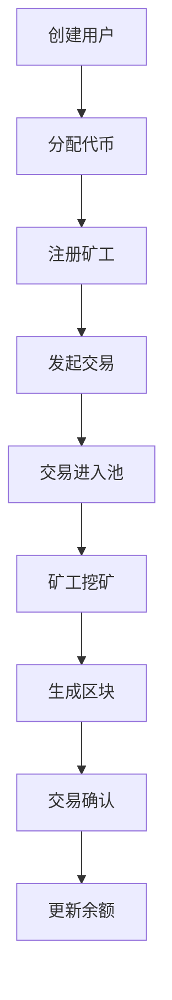

# 🔗 区块链学习系统

一个功能完整的区块链教育系统，帮助你深入理解区块链技术的核心原理。通过实际操作体验用户管理、代币分配、交易处理、挖矿机制和区块浏览等功能。

## ⭐ 项目特色

- 🎯 **完整的学习体验** - 涵盖区块链核心概念的全流程操作
- 🎨 **现代化界面** - 基于 React + Ant Design 的精美UI
- ⚡ **实时数据更新** - 动态展示区块链状态变化
- 🔧 **一键部署** - 提供自动化部署脚本
- 📚 **丰富的教育内容** - 每个功能都包含详细说明
- 🛡️ **安全可靠** - 模拟真实区块链环境

## 🌟 系统功能

### 核心功能模块

| 功能模块 | 描述 | 主要特性 |
|---------|------|----------|
| 👥 **用户管理** | 创建钱包地址、查看余额和交易历史 | 地址生成、余额查询、交易记录 |
| 💰 **代币管理** | 手动分配代币和查看分布统计 | 代币分配、余额排行、分布图表 |
| 💸 **交易管理** | 创建转账交易、查看交易池状态 | 转账功能、手续费机制、交易池 |
| ⛏️ **矿工管理** | 注册矿工、执行挖矿获得奖励 | 矿工注册、PoW挖矿、奖励分发 |
| 🔍 **区块浏览器** | 浏览区块链、查看详细信息 | 区块搜索、交易查询、链统计 |
| 📊 **系统信息** | 监控系统状态和网络活跃度 | 实时监控、性能统计、架构展示 |

### 技术架构

```
┌─────────────────┐    ┌─────────────────┐    ┌─────────────────┐
│   前端界面       │    │   API服务器      │    │   区块链核心     │
│                │    │                │    │                │
│ React + TS     │◄──►│ Express + TS   │◄──►│ 自定义区块链    │
│ Ant Design     │    │ RESTful API    │    │ PoW共识        │
│ 响应式设计      │    │ CORS支持       │    │ 内存存储       │
└─────────────────┘    └─────────────────┘    └─────────────────┘
```

## 🚀 快速开始

### 方法一：一键部署（推荐）

```bash
# 1. 克隆项目
git clone https://github.com/593496637/blockchain-learning-system.git
cd blockchain-learning-system

# 2. 给脚本执行权限
chmod +x deploy.sh stop.sh

# 3. 一键部署并启动
./deploy.sh
```

部署脚本会自动：
- ✅ 检查系统环境
- ✅ 安装前后端依赖
- ✅ 构建后端代码
- ✅ 启动后端服务 (http://localhost:3001)
- ✅ 启动前端服务 (http://localhost:3000)
- ✅ 自动打开浏览器

### 方法二：手动启动

#### 环境要求
- Node.js 16+
- npm 或 yarn

#### 启动后端
```bash
cd backend
npm install
npm run build
npm start
```

#### 启动前端
```bash
cd frontend
npm install
npm start
```

### 停止服务

```bash
# 停止所有服务
./stop.sh
```

## 📋 完整使用流程

### 🎯 建议的学习路径

1. **用户管理** - 创建几个测试用户账户
2. **代币管理** - 给用户分配初始代币余额
3. **矿工管理** - 注册矿工账户准备挖矿
4. **交易管理** - 创建转账交易到交易池
5. **执行挖矿** - 矿工打包交易生成新区块
6. **区块浏览器** - 查看区块链完整状态
7. **系统信息** - 监控系统运行状态

### 🔄 区块链流程图



## 🔧 系统配置

| 配置项 | 默认值 | 说明 |
|--------|-------|------|
| 区块奖励 | 10 代币 | 矿工成功挖矿获得的奖励 |
| 交易手续费 | 0.1 代币 | 每笔交易的手续费 |
| 挖矿难度 | 4级 | 哈希前缀需要4个零 |
| 最大交易数 | 10笔/区块 | 每个区块最多包含的交易数 |
| 区块间隔 | ~10分钟 | 目标区块生成时间 |

## 📖 核心概念学习

### 🔐 区块链基础

- **区块结构** - 区块头、交易列表、前一区块哈希
- **哈希算法** - SHA-256、区块链接、数据完整性
- **共识机制** - 工作量证明(PoW)、挖矿竞争
- **交易处理** - 数字签名、余额验证、手续费
- **网络架构** - 分布式网络、节点同步

### 🛠️ 技术实现

- **地址生成** - 公私钥对、地址编码算法
- **交易验证** - 余额检查、签名验证机制
- **挖矿算法** - 随机数搜索、难度自动调整
- **数据结构** - 链式存储、默克尔树验证
- **API设计** - RESTful接口、实时数据同步

## 📁 项目结构

```
blockchain-learning-system/
├── backend/                 # 后端服务
│   ├── src/
│   │   ├── types.ts        # TypeScript类型定义
│   │   ├── blockchain.ts   # 区块链核心逻辑
│   │   └── index.ts        # Express服务器
│   ├── package.json
│   └── tsconfig.json
├── frontend/               # 前端应用
│   ├── src/
│   │   ├── components/     # React组件
│   │   │   ├── UserManagement.tsx
│   │   │   ├── TokenManagement.tsx
│   │   │   ├── TransactionManagement.tsx
│   │   │   ├── MinerManagement.tsx
│   │   │   ├── BlockExplorer.tsx
│   │   │   └── SystemInfo.tsx
│   │   ├── api.ts         # API调用封装
│   │   ├── types.ts       # 类型定义
│   │   ├── App.tsx        # 主应用组件
│   │   └── App.css        # 样式文件
│   └── package.json
├── deploy.sh              # 一键部署脚本
├── stop.sh                # 停止服务脚本
├── start.sh               # 启动脚本
├── README.md              # 项目说明
├── INSTALL.md             # 安装指南
├── COMPONENTS.md          # 组件说明
└── LICENSE                # 开源协议
```

## 🎨 界面预览

### 主要功能界面

- 🏠 **欢迎页面** - 功能导航和学习路径
- 👥 **用户管理** - 用户创建、余额查看、交易历史
- 💰 **代币管理** - 代币分配、分布统计、余额排行
- 💸 **交易管理** - 转账操作、交易池状态、手续费说明
- ⛏️ **矿工管理** - 矿工注册、挖矿操作、奖励统计
- 🔍 **区块浏览器** - 区块列表、交易搜索、链统计
- 📊 **系统信息** - 状态监控、性能指标、架构说明

### 特色功能

- 📱 **响应式设计** - 支持各种屏幕尺寸
- 🎯 **实时更新** - 自动刷新显示最新状态
- 🎨 **动画效果** - 丰富的交互动画
- 🔍 **搜索功能** - 强大的数据搜索能力
- 📊 **数据可视化** - 图表展示统计信息

## 🔧 开发指南

### 本地开发

```bash
# 开发模式启动后端（支持热重载）
cd backend
npm run dev

# 开发模式启动前端
cd frontend
npm start
```

### 构建生产版本

```bash
# 构建后端
cd backend
npm run build

# 构建前端
cd frontend
npm run build
```

### API接口

后端提供完整的RESTful API：

- `GET /api/health` - 健康检查
- `GET /api/users` - 获取用户列表
- `POST /api/users` - 创建新用户
- `GET /api/blockchain` - 获取区块链
- `GET /api/transactions` - 获取交易池
- `POST /api/transactions` - 创建交易
- `GET /api/miners` - 获取矿工列表
- `POST /api/miners` - 注册矿工
- `POST /api/mine` - 执行挖矿

## 🌈 扩展建议

项目可以进一步扩展的功能：

- 🗄️ **数据持久化** - 集成数据库存储
- 🌐 **P2P网络** - 实现真正的点对点通信
- 📝 **智能合约** - 添加合约编程功能
- 🔐 **多重签名** - 支持多重签名钱包
- 📈 **高级图表** - 更丰富的数据可视化
- 🎮 **游戏化** - 增加学习游戏元素
- 🌍 **国际化** - 多语言支持
- 📱 **移动应用** - React Native版本

## 🤝 贡献指南

欢迎为项目贡献代码！

1. Fork 本仓库
2. 创建功能分支 (`git checkout -b feature/amazing-feature`)
3. 提交更改 (`git commit -m 'Add some amazing feature'`)
4. 推送到分支 (`git push origin feature/amazing-feature`)
5. 打开 Pull Request

### 开发规范

- 使用 TypeScript 编写代码
- 遵循 ESLint 规则
- 编写清晰的注释
- 保持代码简洁易读

## 📚 学习资源

- 📖 [区块链技术指南](https://github.com/yeasy/blockchain_guide)
- 📄 [比特币白皮书](https://bitcoin.org/bitcoin.pdf)
- 🌐 [以太坊开发文档](https://ethereum.org/zh/developers/docs/)
- 🎓 [Solidity官方教程](https://docs.soliditylang.org/)

## 🐛 问题反馈

遇到问题？

1. 检查 [Issues](https://github.com/593496637/blockchain-learning-system/issues) 页面
2. 查看日志文件：`backend.log` 和 `frontend.log`
3. 创建新的 Issue 描述问题

## 📄 开源协议

本项目采用 [MIT License](LICENSE) 开源协议。

## 👨‍💻 作者

- **区块链学习团队** - *初始开发* - [593496637](https://github.com/593496637)

## 🙏 致谢

感谢所有为区块链技术发展做出贡献的开发者和研究者！

---

## ⚠️ 重要提示

💡 **这是一个教育用的区块链实现**，主要特点：

- ✅ 适合学习区块链基本原理
- ✅ 简化的 PoW 共识算法  
- ✅ 内存数据存储（重启后重置）
- ✅ 单节点运行环境
- ❌ **不适用于生产环境**
- ❌ **不具备真实区块链的安全特性**

**享受你的区块链学习之旅！** 🎓✨

## 📞 联系方式

- 📧 Email: 593496637@qq.com
- 🌐 GitHub: [@593496637](https://github.com/593496637)

---

<div align="center">

**⭐ 如果这个项目对你有帮助，请给一个星星！⭐**

</div>
