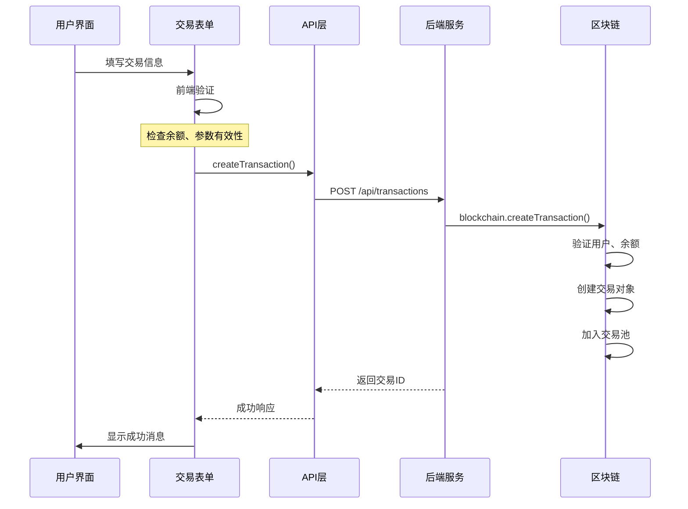
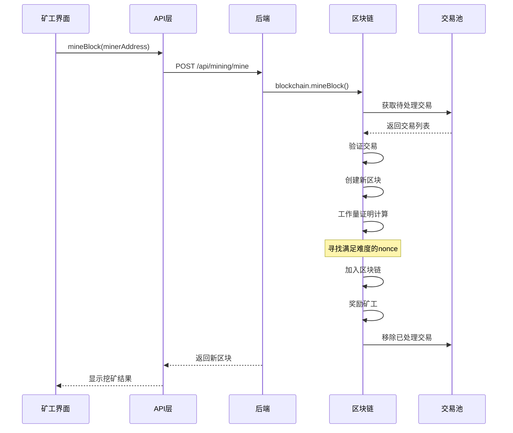

# 完整业务流程分析

## 1. 系统启动流程

### 1.1 后端启动序列

```typescript
// 1. 创建区块链实例
const blockchain = new Blockchain();

// 2. 配置Express服务器
const app = express();
app.use(cors());
app.use(express.json());

// 3. 启动服务器
app.listen(PORT, () => {
  console.log('🚀 区块链学习系统启动成功！');
  
  // 4. 创建测试数据
  const alice = blockchain.createUser('Alice');
  const bob = blockchain.createUser('Bob');
  
  // 5. 分配初始代币
  blockchain.allocateTokens(alice.address, 100);
  blockchain.allocateTokens(bob.address, 50);
  
  // 6. 注册测试矿工
  const miner1 = blockchain.registerMiner('Miner_Alpha');
  const miner2 = blockchain.registerMiner('Miner_Beta');
});
```

**启动过程说明：**
1. 自动创建创世块（index: 0）
2. 初始化空的交易池
3. 设置系统配置参数
4. 创建演示用测试数据

### 1.2 前端启动序列

```typescript
function App() {
  useEffect(() => {
    // 1. 首次加载系统信息
    loadSystemInfo();
    
    // 2. 设置定时刷新（每10秒）
    const interval = setInterval(loadSystemInfo, 10000);
    
    // 3. 清理定时器
    return () => clearInterval(interval);
  }, []);

  const loadSystemInfo = async () => {
    try {
      setConnectionStatus('connecting');
      
      // 并行获取数据
      const [infoResponse, usersResponse] = await Promise.all([
        api.getBlockchainInfo(),
        api.getUsers()
      ]);
      
      // 更新状态
      if (infoResponse.success) setBlockchainInfo(infoResponse.data);
      if (usersResponse.success) setUsers(usersResponse.data);
      
      setConnectionStatus('connected');
    } catch (error) {
      setConnectionStatus('disconnected');
    }
  };
}
```

## 2. 完整交易流程详解

### 2.1 用户创建交易（前端）



### 2.2 交易创建详细步骤

#### 前端验证阶段
```typescript
const createTransaction = async () => {
  // 1. 基础参数验证
  if (!fromUser || !toUser || amount <= 0) {
    setMessage('请填写完整的交易信息');
    return;
  }

  // 2. 逻辑验证
  if (fromUser === toUser) {
    setMessage('发送方和接收方不能相同');
    return;
  }

  // 3. 余额预检查（前端优化）
  const sender = users.find(u => u.address === fromUser);
  if (sender && sender.balance < amount + 0.1) {
    setMessage('余额不足（包含手续费0.1代币）');
    return;
  }

  // 4. 发送API请求
  const response = await api.createTransaction(fromUser, toUser, amount);
};
```

#### 后端处理阶段
```typescript
app.post('/api/transactions', (req, res) => {
  try {
    const { from, to, amount } = req.body;
    
    // 1. 参数验证
    if (!from || !to || !amount || amount <= 0) {
      return res.status(400).json({
        success: false,
        error: '交易参数无效'
      });
    }

    // 2. 调用区块链处理
    const transactionId = blockchain.createTransaction(from, to, amount);
    
    // 3. 返回结果
    if (transactionId) {
      res.json({
        success: true,
        data: { transactionId },
        message: '交易已创建并加入交易池'
      });
    } else {
      res.status(400).json({
        success: false,
        error: '交易创建失败，请检查余额和账户'
      });
    }
  } catch (error) {
    res.status(500).json({
      success: false,
      error: '创建交易失败'
    });
  }
});
```

#### 区块链核心处理
```typescript
createTransaction(from: string, to: string, amount: number): string | null {
  // 1. 获取用户信息
  const sender = this.users.get(from);
  const receiver = this.users.get(to);

  // 2. 验证用户存在
  if (!sender || !receiver) {
    return null;
  }

  // 3. 计算总费用
  const totalCost = amount + this.config.minFee;
  
  // 4. 验证余额
  if (sender.balance < totalCost) {
    return null;
  }

  // 5. 创建交易对象
  const transaction: Transaction = {
    id: uuidv4(),
    from, to, amount,
    fee: this.config.minFee,
    timestamp: Date.now(),
    status: 'pending'
  };

  // 6. 加入交易池
  this.pendingTransactions.push(transaction);
  return transaction.id;
}
```

## 3. 挖矿流程详解

### 3.1 挖矿触发流程



### 3.2 工作量证明算法详解

```typescript
// 挖矿核心算法
mineBlock(minerAddress: string): Block | null {
  // 1. 准备阶段
  const miner = this.miners.get(minerAddress);
  if (!miner?.isActive) return null;

  // 2. 选择交易
  const transactionsToMine = this.pendingTransactions
    .slice(0, this.config.maxTransactionsPerBlock);

  if (transactionsToMine.length === 0) return null;

  // 3. 验证并处理交易
  const validTransactions: Transaction[] = [];
  for (const tx of transactionsToMine) {
    if (this.validateAndProcessTransaction(tx)) {
      validTransactions.push(tx);
    }
  }

  // 4. 创建候选区块
  const newBlock: Block = {
    index: this.chain.length,
    timestamp: Date.now(),
    transactions: validTransactions,
    previousHash: this.getLatestBlock().hash,
    hash: '',
    nonce: 0,
    miner: minerAddress,
    reward: this.config.blockReward
  };

  // 5. 工作量证明计算
  const startTime = Date.now();
  while (true) {
    // 计算当前哈希
    newBlock.hash = this.calculateHash(newBlock);
    
    // 检查是否满足难度要求
    if (newBlock.hash.substring(0, this.config.difficulty) === 
        '0'.repeat(this.config.difficulty)) {
      break; // 找到有效哈希
    }
    
    newBlock.nonce++; // 增加随机数重试
  }
  const miningTime = Date.now() - startTime;

  // 6. 完成挖矿
  this.chain.push(newBlock);                    // 加入主链
  this.rewardMiner(minerAddress, newBlock.reward, validTransactions); // 奖励矿工
  this.pendingTransactions = this.pendingTransactions  // 清理交易池
    .filter(tx => !validTransactions.find(vtx => vtx.id === tx.id));

  return newBlock;
}
```

### 3.3 交易验证与执行

```typescript
private validateAndProcessTransaction(transaction: Transaction): boolean {
  const sender = this.users.get(transaction.from);
  const receiver = this.users.get(transaction.to);

  // 验证用户存在
  if (!sender || !receiver) return false;

  // 验证余额充足
  const totalCost = transaction.amount + transaction.fee;
  if (sender.balance < totalCost) return false;

  // 执行转账（原子操作）
  sender.balance -= totalCost;              // 扣除发送方
  receiver.balance += transaction.amount;   // 增加接收方
  transaction.status = 'confirmed';         // 标记已确认

  return true;
}
```

## 4. 数据同步机制

### 4.1 前端数据流

```typescript
// 主应用数据流
App (全局状态)
 ├── loadSystemInfo() - 定时获取系统信息
 ├── blockchainInfo - 区块链状态
 ├── users - 用户列表缓存
 └── connectionStatus - 连接状态

// 组件间通信
UserManagement
 ├── 本地状态管理输入
 ├── 操作完成后调用 onRefresh()
 └── 通知 App 组件刷新全局数据

TransactionManagement
 ├── 接收 users 属性（来自App）
 ├── 创建交易后刷新交易池
 └── 调用 onRefresh() 更新系统状态

MinerManagement
 ├── 挖矿后全面刷新数据
 └── 触发父组件数据更新
```

### 4.2 实时更新策略

```typescript
// 定时刷新机制
useEffect(() => {
  loadSystemInfo();
  const interval = setInterval(loadSystemInfo, 10000); // 10秒
  return () => clearInterval(interval);
}, []);

// 操作触发刷新
const handleRefresh = () => {
  loadSystemInfo(); // 立即刷新
};

// 组件级别刷新
const createUser = async () => {
  // ... 创建用户逻辑
  if (response.success) {
    await loadUsers();    // 刷新本地用户列表
    onRefresh();          // 触发全局刷新
  }
};
```

## 5. 错误处理与恢复

### 5.1 分层错误处理

```typescript
// API层错误处理
const handleApiRequest = async <T>(request: () => Promise<T>): Promise<ApiResponse<T>> => {
  try {
    const data = await request();
    return { success: true, data };
  } catch (error) {
    console.error('API Error:', error);
    return { 
      success: false, 
      error: error instanceof Error ? error.message : 'Unknown error' 
    };
  }
};

// 组件层错误处理
const createUser = async () => {
  setLoading(true);
  try {
    const response = await api.createUser(newUserName);
    if (response.success) {
      setMessage('用户创建成功！');
    } else {
      setMessage(`创建失败: ${response.error}`);
    }
  } catch (error) {
    setMessage('创建用户时发生错误');
  } finally {
    setLoading(false);
  }
};

// 连接状态恢复
const loadSystemInfo = async () => {
  try {
    setConnectionStatus('connecting');
    // ... API调用
    setConnectionStatus('connected');
  } catch (error) {
    setConnectionStatus('disconnected');
    // 错误状态下不阻塞用户操作
  }
};
```

### 5.2 用户体验优化

```typescript
// 加载状态反馈
{loading ? (
  <button disabled className="loading">
    操作中...
  </button>
) : (
  <button onClick={handleSubmit}>
    提交
  </button>
)}

// 连接状态指示
<div className={`status ${connectionStatus}`}>
  {connectionStatus === 'connected' && '✅ 已连接'}
  {connectionStatus === 'connecting' && '🔄 连接中'}
  {connectionStatus === 'disconnected' && '❌ 连接失败'}
</div>

// 自动消息清除
useEffect(() => {
  if (message) {
    const timer = setTimeout(() => setMessage(''), 5000);
    return () => clearTimeout(timer);
  }
}, [message]);
```

## 6. 性能优化策略

### 6.1 前端性能优化

```typescript
// 数据缓存
const [cache, setCache] = useState<{
  users: User[];
  blocks: Block[];
  lastUpdate: number;
}>({
  users: [],
  blocks: [],
  lastUpdate: 0
});

// 避免重复请求
const loadUsers = async (forceRefresh = false) => {
  const cacheValid = Date.now() - cache.lastUpdate < 30000; // 30秒缓存
  
  if (!forceRefresh && cacheValid && cache.users.length > 0) {
    return cache.users;
  }
  
  const response = await api.getUsers();
  if (response.success) {
    setCache(prev => ({
      ...prev,
      users: response.data!,
      lastUpdate: Date.now()
    }));
  }
};

// 组件优化
const BlockItem = React.memo<{ block: Block }>(({ block }) => (
  <div className="block-item">
    <div>区块 #{block.index}</div>
    <div>交易数: {block.transactions.length}</div>
  </div>
));
```

### 6.2 后端性能考虑

```typescript
// 数据结构优化
private users: Map<string, User> = new Map();    // O(1) 查找
private miners: Map<string, Miner> = new Map();  // O(1) 查找
private chain: Block[] = [];                     // 顺序访问

// 交易池管理
private pendingTransactions: Transaction[] = [];

// 限制每次处理的交易数量
const transactionsToMine = this.pendingTransactions
  .slice(0, this.config.maxTransactionsPerBlock);

// 内存存储的优势
// - 无I/O延迟
// - 适合演示和学习
// - 简化实现复杂度
```

## 7. 安全机制

### 7.1 前端安全验证

```typescript
// 输入验证
const validateInput = (value: string, type: string) => {
  switch (type) {
    case 'amount':
      return value && parseFloat(value) > 0;
    case 'address':
      return value && value.length === 40; // 地址长度检查
    default:
      return true;
  }
};

// 余额预检查
const checkBalance = (userAddress: string, amount: number) => {
  const user = users.find(u => u.address === userAddress);
  return user && user.balance >= amount + 0.1; // 包含手续费
};
```

### 7.2 后端安全保障

```typescript
// 严格的余额验证
if (sender.balance < totalCost) {
  return null; // 阻止超额支付
}

// 原子性交易处理
private validateAndProcessTransaction(transaction: Transaction): boolean {
  // 验证 -> 执行 -> 确认，三步一体
  if (验证通过) {
    执行转账();
    标记确认();
    return true;
  }
  return false;
}

// 哈希完整性
private calculateHash(block: Block): string {
  // 包含所有关键字段，确保不可篡改
  const data = block.index + block.previousHash + /* ... */;
  return crypto.createHash('sha256').update(data).digest('hex');
}
```

这个完整的业务流程分析展示了区块链学习系统从用户操作到底层处理的全过程，包括数据流、错误处理、性能优化和安全机制等关键环节。